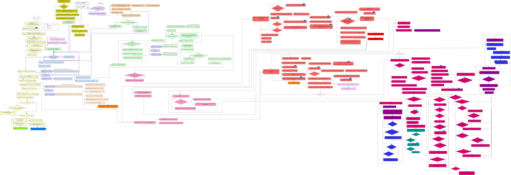

# ReactJS 底层揭秘

本库包含 ReactJS 内部工作原理的说明。实际上，我在调试整个代码库时，将所有的逻辑放在可视化的流程图上，对它们进行分析，然后总结和解释主要的概念和方法。我已经完成了 Stack 版本，现在我在研究下一个版本 —— Fiber。

> 通过 [github-pages 网站](https://bogdan-lyashenko.github.io/Under-the-hood-ReactJS/)来以最佳格式阅读.

> 为了让它变得更好，如果你有任何想法，欢迎随时提 issue。

每张流程图都可以通过点击在新的选项卡中打开，然后通过缩放使它适合阅读。在单独的窗口（选项卡）中保留文章和正在阅读的流程图，将有助于更容易地匹配文本和代码流。

我们将在这里谈论 ReactJS 的两个版本，老版本使用的是 Stack 协调引擎，新版本使用的是 Fiber（你可能已经知道，React v16 已经正式发布了）。让我们先深入地了解（目前广泛使用的）React-Stack 的工作原理，并期待下 React-Fiber 带来的重大变革。我们使用 [React v15.4.2](https://github.com/facebook/react/tree/v15.4.2) 来解释“旧版 React”的工作原理。

## Stack

整个流程图分为 15 个部分，让我们开始吧。

* [介绍](../../../../stack/languages/chinese/book/Intro.md)
* [Part 0](../../../../stack/languages/chinese/book/Part-0.md)
* [Part 1](../../../../stack/languages/chinese/book/Part-1.md)
* [Part 2](../../../../stack/languages/chinese/book/Part-2.md)
* [Part 3](../../../../stack/languages/chinese/book/Part-3.md)
* [Part 4](../../../../stack/languages/chinese/book/Part-4.md)
* [Part 5](../../../../stack/languages/chinese/book/Part-5.md)
* [Part 6](../../../../stack/languages/chinese/book/Part-6.md)
* [Part 7](../../../../stack/languages/chinese/book/Part-7.md)
* [Part 8](../../../../stack/languages/chinese/book/Part-8.md)
* [Part 9](../../../../stack/languages/chinese/book/Part-9.md)
* [Part 10](../../../../stack/languages/chinese/book/Part-10.md)
* [Part 11](../../../../stack/languages/chinese/book/Part-11.md)
* [Part 12](../../../../stack/languages/chinese/book/Part-12.md)
* [Part 13](../../../../stack/languages/chinese/book/Part-13.md)
* [Part 14](../../../../stack/languages/chinese/book/Part-14.md)

## Fiber
1. [介绍](../../../../fiber/book/Intro.md) [TODO]
